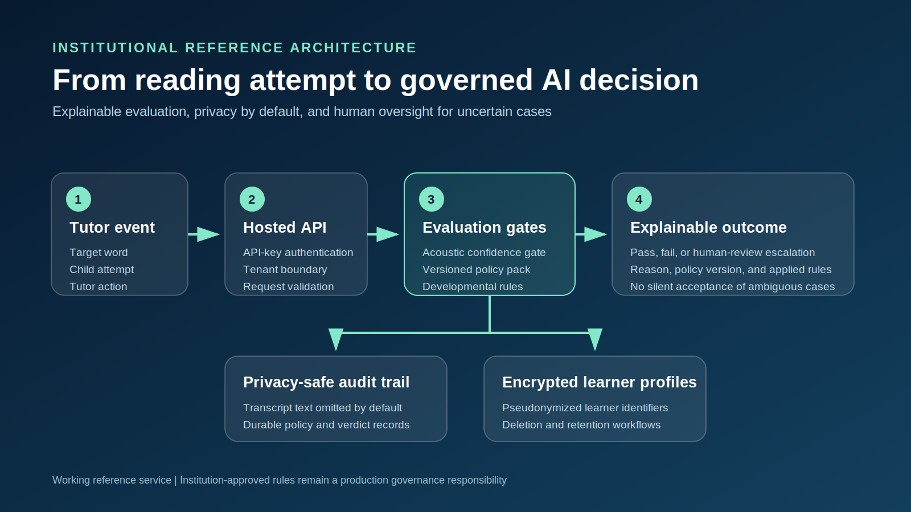
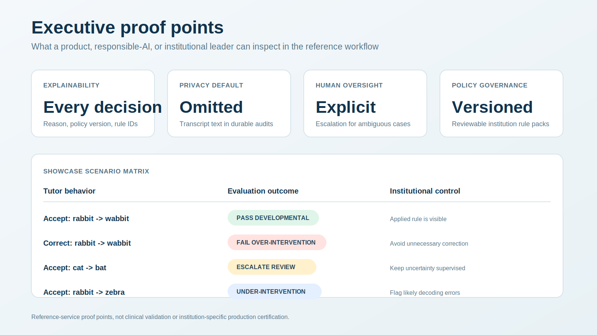
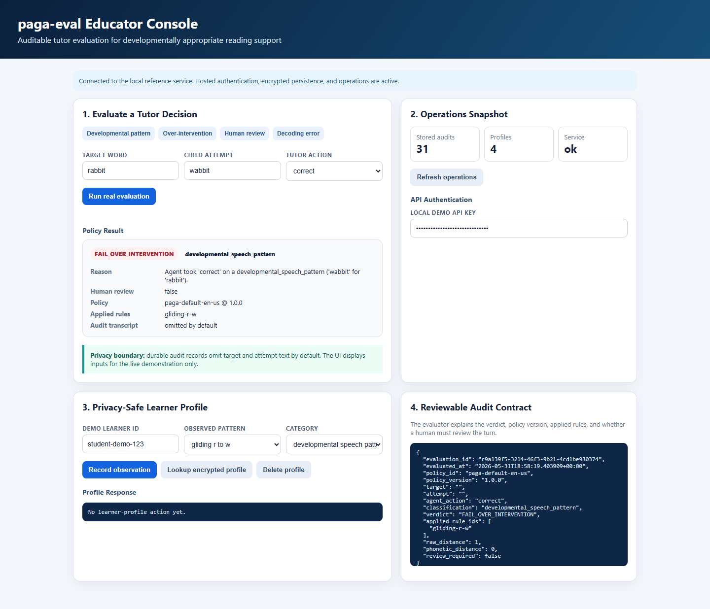

# paga-eval

**Auditable, developmentally-aware evaluation guardrails for child-reading tutor
agents.**

`paga-eval` helps education companies and institutions answer a high-stakes
product question: did an AI tutor respond appropriately to a child's reading
attempt?

It prevents a subtle but important failure mode. A basic evaluator may reward a
tutor for interrupting an age-appropriate speech pattern, such as reading
`rabbit` as `wabbit`. `paga-eval` separates developmental patterns from likely
decoding errors, explains each decision, and escalates uncertain cases for human
review.

This repository is a working reference service for product, engineering, and
responsible-AI review. It is not a clinical diagnostic tool or a completed
institutional deployment.

## Executive Snapshot

| Leadership question | What this reference service demonstrates |
| --- | --- |
| Can an AI tutor avoid unnecessary correction? | Developmentally-aware rules distinguish speech patterns from likely decoding errors. |
| Can a reviewer explain a decision? | Every evaluation returns a verdict, reason, policy version, and applied rule IDs. |
| Can ambiguous cases remain supervised? | Uncertain near-matches route to explicit human review. |
| Can learner data exposure be reduced? | Audit transcripts are omitted by default and profile storage is encrypted in the hosted workflow. |
| Can an institution govern changes? | Policy packs are versioned, reviewable, and replaceable with institution-approved rules. |

The bundled policy is deliberately narrow. Institutions should validate and
approve policy packs with educators and speech-language pathologists before
production use.

## Visual Showcase

Watch the composed executive walkthrough:

> [`paga-eval` showcase video](docs/assets/paga-eval-showcase.webm)

### Reference architecture



### Leadership dashboard



### Live console proof



## Run The Demo

### One-click static portfolio demo

Open the GitHub Pages version of
[`examples/institution_demo.html`](examples/institution_demo.html):

> Interactive demo:
> [`https://lahari99-cloud.github.io/paga-eval/examples/institution_demo.html`](https://lahari99-cloud.github.io/paga-eval/examples/institution_demo.html)

When no API is reachable, the page clearly switches to static portfolio mode.
The four evaluator scenarios continue to work in-browser. Authentication,
encrypted persistence, learner profiles, deletion, and operations are
explicitly disabled because those require the hosted service.

### Technical reviewer workflow

```bash
pip install -e ".[dev,integrations,service]"
python examples/run_institution_demo.py
# open http://127.0.0.1:8000/demo
```

Always use `http://127.0.0.1:8000/demo` when reviewing a cloned repository. The
same-origin console demonstrates real API authentication, privacy-by-default
audits, encrypted learner-profile storage, deletion, and operations counts.
The prefilled API key and local SQLite path are demo-only defaults; do not deploy
them. The standalone files under `examples/acoustic_gate_*_demo.html` are visual
explainers with browser-side simulation logic. Use the educator console for a
buyer-facing walkthrough of the running service.

## Why It Is Different

A naive evaluator treats every transcript deviation as a reading error.
`paga-eval` separates:

- `clean_reading`
- `developmental_speech_pattern`
- `decoding_error`
- `uncertain_requires_review`

It evaluates the tutor's decision, records the policy version and applied rules,
and routes ambiguous cases to human review.

## Install

```bash
pip install -e ".[dev]"
pytest tests/ -v
```

## Quickstart

```python
from paga import PhonemeAwareOverInterventionMetric, Verdict

metric = PhonemeAwareOverInterventionMetric()

result = metric.evaluate(
    target="rabbit",
    attempt="wabbit",
    agent_action="correct",
)

assert result.verdict is Verdict.FAIL_OVER_INTERVENTION
print(result.classification)            # developmental_speech_pattern
print(result.applied_rule_ids)          # ["gliding-r-w"]
print(result.audit_record.to_dict())    # JSON-serializable audit record
```

Audit records omit target and attempt text by default. A governed policy pack can
explicitly select `AuditTextMode.HASHED` or `AuditTextMode.PLAINTEXT`.

Unexplained near-matches are not silently accepted:

```python
result = metric.evaluate("cat", "bat", "accept")
print(result.verdict)          # ESCALATE_REVIEW
print(result.review_required)  # True
```

## Versioned Policy Packs

The bundled `en-US` rule set is a starter policy, not a universal clinical
standard. Institutions should approve and version rules with educators and
speech-language pathologists.

```python
from paga import DevelopmentalRule, PolicyPack, PhonemeAwareOverInterventionMetric

policy = PolicyPack(
    policy_id="district-reading-policy",
    version="2026.1",
    rules=(
        DevelopmentalRule(
            rule_id="gliding-r-w",
            source="r",
            replacement="w",
            process="gliding",
            age_range="district-approved early-reader band",
            evidence_reference="Internal SLP review 2026-04",
        ),
    ),
)
metric = PhonemeAwareOverInterventionMetric(policy_pack=policy)

# Store policy.to_dict() in your governed configuration system.
# Restore approved configuration with PolicyPack.from_dict(payload).
```

See `examples/district_policy_pack.json` for a reviewable configuration template.

## Privacy-Safe Learner Profiling

Repeated articulation patterns stay visible without automatically becoming
reading deficits. Focused lessons trigger only for persistent decoding errors by
default.

```python
from paga import LearnerProfileAdapter, PatternCategory

profiles = LearnerProfileAdapter(
    persistence_threshold=3,
    pseudonymization_salt="load-this-from-your-secrets-manager",
    retention_days=30,
    production_mode=True,
)
profiles.update_profile("student-123", "gliding_r_w")
profiles.update_profile(
    "student-123",
    "word_substitution",
    category=PatternCategory.DECODING_ERROR,
)
profiles.delete_profile("student-123")
profiles.prune_expired_profiles()
```

## Institutional Reporting

```python
from paga import build_institutional_report

report = build_institutional_report([
    ("grade-k", metric.evaluate("rabbit", "wabbit", "accept")),
    ("grade-k", metric.evaluate("think", "fink", "correct")),
])
print(report.to_json())
print(report.to_csv())
```

Reports include cohort-level pass, over-intervention, under-intervention, and
human-review rates without learner identifiers. See
`examples/institutional_quality_report.py`.

## Benchmarks

Policy packs should be evaluated against institution-reviewed cohort cases before
deployment. A small starter fixture and runner are included:

```python
from paga import load_benchmark, run_benchmark

outcome = run_benchmark(load_benchmark("benchmarks/starter_en_us.json"))
print(outcome.expected_verdict_accuracy)
print(outcome.report.to_json())
```

The starter fixture verifies package behavior only. It is not a clinical,
multilingual, dialect, or production fairness dataset.

## Integration Contracts

The core includes transport-neutral helpers for web handlers and buyer-specific
adapters:

```python
from paga import EvaluationService

service = EvaluationService()
response = service.evaluate_payload({
    "target": "rabbit",
    "attempt": "wabbit",
    "action": "accept",
    "evaluation_id": "eval-123",
})
```

`to_lti_ags_score_payload()` produces an LTI Assignment and Grade Services score
body, routing human-review cases to manual grading.
`to_edfi_assessment_result_payload()` produces a starter Ed-Fi assessment mapping
with optional CASE alignment. Deployments must validate these mappings against
their LMS, Ed-Fi version, API profile, and certification requirements.

## Included Developmental Rules

The default starter pack contains grapheme-level approximations for gliding,
`th` fronting and stopping, interdental lisping, and selected stopping patterns.
This heuristic layer is intentionally auditable and inexpensive. It is not a
phonemic transcription engine.

## Integrations

See `examples/langgraph_tutor_eval.py` for a LangGraph example with persistent
learner profiling. For privacy controls, governance requirements, and the
institutional integration roadmap, read
`docs/INSTITUTIONAL_DEPLOYMENT.md`.

## Enterprise Features: Acoustic Gate for Production ASR Systems

For production deployments with real-world ASR systems (like wav2vec), `paga-eval`
includes an `EnterprisePhonemeEvaluator` that adds acoustic confidence gating to
prevent evaluation of low-quality ASR hypotheses:

```python
from paga import EnterprisePhonemeEvaluator

# Creates an evaluator with multi-level acoustic validation:
# 1. Mean confidence threshold (overall signal quality)
# 2. Per-phoneme confidence threshold (individual unit reliability)
# 3. Phoneme ratio threshold (consistency across utterance)
evaluator = EnterprisePhonemeEvaluator(
    min_acoustic_confidence=0.72,      # Overall signal quality threshold
    min_phoneme_confidence=0.5,        # Individual phoneme reliability
    min_phoneme_ratio=0.8,             # Consistency requirement
    on_acoustic_bypass=log_bypass_event # Optional observability hook
)

# Process ASR output with confidence scores
result = evaluator.evaluate_live_turn(
    target="rabbit",
    attempt="wabbit",
    agent_action="accept",
    acoustic_confidence_scores=[0.8, 0.9, 0.7, 0.8]  # From wav2vec, etc.
)

# If acoustic quality is poor, returns ESCALATE_REVIEW instead of False PASS/FAIL
if result["verdict"] == "ESCALATE_REVIEW":
    # Log for observability, trigger human review
    handle_low_confidence_asis(result)
```

This prevents the "Acoustic Confidence Trap" where ASR hallucinations during
silence or noise could produce flawed evaluations and contaminated audit trails.

See `tests/test_phoneme_engine.py` for comprehensive test coverage of the
acoustic gating functionality.

## Hosted Service

Install the optional service layer:

```bash
pip install -e ".[service]"
```

Configure secrets using `.env.example`, then run:

```bash
uvicorn paga.api:create_app --factory --host 0.0.0.0 --port 8000
```

For the containerized reference deployment:

```bash
docker compose up --build
```

The hosted API includes:

- `GET /healthz` and `GET /readyz`
- authenticated `POST /v1/evaluations`
- authenticated cohort reporting at `POST /v1/reports`
- encrypted learner-profile update, lookup, and deletion endpoints
- authenticated retention pruning and operational-count endpoints
- transcript omission from evaluator audit records by default

All `/v1` routes require `X-API-Key`. The simple `PAGA_API_KEY` mode grants all
permissions to the default tenant. Production deployments can configure
`PAGA_API_KEYS_JSON` with tenant-scoped credentials and independent `evaluate`,
`report`, `profile:read`, `profile:write`, and `operations` permissions. For
container deployment, use the included `Dockerfile` and mount a durable writable
volume at `/data`.

The hosted service emits privacy-bounded JSON request logs for central
collection. Logs contain request correlation, tenant namespace, method, path,
status, and duration without request bodies, headers, transcripts, learner
identifiers, or API keys.

The checked-in `openapi.json` is the reviewable hosted-service contract. Regenerate
it with `python scripts/export_openapi.py` and follow
`docs/RELEASE_CHECKLIST.md` before publishing a release.

The Docker image installs through `constraints/service-py312.txt` so its Python
dependency graph is repeatable and pins its verified Python base-image digest.
Run `scripts/docker_smoke.ps1` on Windows to build, wait for native health,
verify readiness and non-root execution, and clean up the temporary Compose
stack. Run `scripts/generate_sbom.ps1` to produce an SPDX JSON dependency record
for the release archive.

The operator CLI validates encrypted-store integrity, creates atomic online
backups, applies retention, and rotates encryption:

```bash
python -m paga.maintenance check
python -m paga.maintenance backup --output /approved-backup-path/paga.sqlite3
python -m paga.maintenance prune
python -m paga.maintenance rotate-encryption
```

## License

MIT
